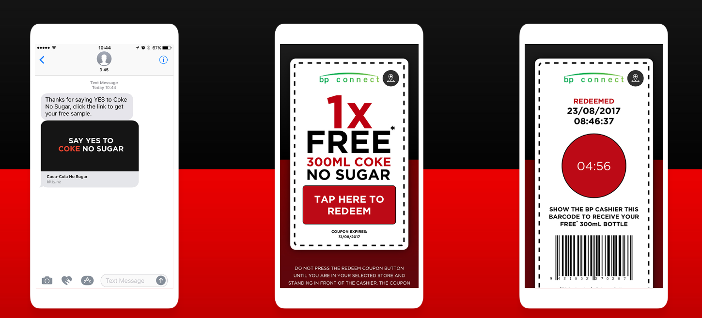
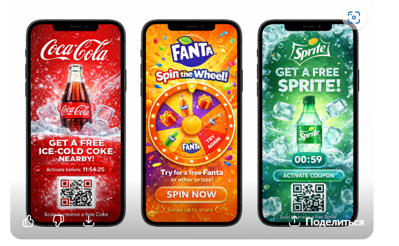

DIGITAL COUPON SAMPLING

1.  **Контекст проекта**

В рамках брифа и с учетом предыдущих компаний, клиент предлагает
использовать 2 основных сценария семплинга – мобильный и брендированные
sampling zone.

Мы бы хотели предложить дополнить проект тестовым сценарием на
территории Казахстана.

Трений сценарий – Digital Coupon Sampling, который может дополнить
оффлайн активации и решить ряд операционных задач проекта и сохранить
вовлекающий вайб для каждого бренда.

2.  **Почему имеет смысл протестировать Digital Sampling**

В брифе клиента стоит акцент на операционные задачи:

- Необходимость выдачи охлажденного продукта

- не простая логистика и хранение

- контроль возможных злоупотреблений при больших объемах

Третий сценарий минимизировать риски выполнения операционных задач. Плюс
добавит новый охватный канал для семплинга – диджитал.

Так же данный сценарий позволяет получать данные о ходе семплинга в
реальном времени и корректировать подход и креативы.

3.  **Механика семплинга**

1\. Пользователь видит рекламное сообщение в digital-канале (выбор
каналов на стороне медийного агентства + можно подключать UGC
креаторов).

Н-р: Выбери, что хочешь попробовать сам или твой друг? (изображение
продукта) – здесь нужен копирайт и дизайн.

2\. Пользователь нажимает на рекламное объявление и переходит на
промо-страницу. (возможно интегрироваться в приложение Extra Zone – но
не на первом этапе проекта)

3\. Вводит номер телефона

4\. Выбирает продукт (Cola/Fanta/Sprite) и может выбрать ретейл партнера
для получения продукта.

5\. Получает купон с уникальным штрих-кодом или промо-кодом (купон
отражается в личном кабинете)

Купон может быть использован в оффлайн-ретейле или delivery-заказ еды.
Купоном можно делиться с друзьями.

6\. Перед забором продукта купон активируется и сканируется кассиром,
после сканирования он не может быть использован повторно.

Чуть больше о купоне😊 (может быть брифом дизайнеру)

**Купон - не просто QR-код**, а **полноценный рекламный носитель и
mini-media**, который может:

- передавать бренд-позиционирование

- вовлекать (анимация, геймификация)

- стимулировать sharing

В американской и азиатской практике (США, Корея, Япония) **digital
coupons часто выглядят как динамические карточки**, а не как простые
штрих-коды.

Купон выглядит как брендированная карточка, где есть: логотип бренда,
визуал напитка, кнопка активации, QR / barcode

Это не просто купон, а брендированный рекламный экран! Можно добавить
анимацию, эффект холодного напитка, обратный отчет по использованию
купона.

Купон может быть интерактивным – стереть экран, встряхнуть телефон…. и
после взаимодействия появляется купон.

Купон может быть игровым – например «Spin the wheel» - выигрывай (Cola,
Fanta, Sprite или что-то)

Купон может работать, как подарок другу.

4.  **Customer Journey пользователя**

1\. Пользователь видит рекламное сообщение.\
2. Переходит на лендинг акции.\
3. Вводит номер телефона, выбирает партнера.\
4. Получает купон.\
5. Приходит в retail‑точку или оформляет онлайн‑заказ.\
6. Активирует купон.\
7. Получает охлажденный напиток.\
8. Делится купоном или впечатлением с друзьями.

5.  **Решение ключевых задач проекта**

Температура продукта\
Выдача происходит из холодильников магазинов.

Логистика\
Нет необходимости доставлять продукт на точки семплинга.

Контроль\
Каждый купон уникален и может быть использован только один раз.

Вовлекающий механика может быть реализована через легкую геймификацию
перед получением купона с акцентом на позиционирования каждого бренда.
Во время кампании можно менять креативы под релевантный окейжен.

Аналитика\
Система фиксирует получение и активацию купона и все это в режиме
реального времени.

6.  **Интерактивная панель управления**

В рамках проекта может быть создан интерактивный dashboard.

Он позволит:

• отслеживать заявки на купоны\
• видеть активации в реальном времени\
• анализировать популярность брендов\
• видеть пики активности аудитории

Это позволит корректировать digital‑размещение и оптимизировать
кампанию.

7.  **Ценность для брендов (Coca-Cola / Fanta / Sprite) – здесь надо
    просто для примера, и точно нужно чтобы посмотрела креативная
    команда**

Digital Coupon Sampling позволяет усилить позиционирование каждого
бренда.

Coca‑Cola\
• укрепление имиджа классического освежающего напитка\
• интеграция с повседневными моментами потребления (еда, встречи,
прогулки)

Fanta\
• создание эмоционального, игрового опыта\
• возможность использовать геймификацию и сюрпризы

Sprite\
• акцент на освежении и утолении жажды\
• коммуникация через lifestyle и urban‑культуру

Дополнительно:\
• сбор данных о предпочтениях аудитории\
• тестирование новых digital‑механик вовлечения.

8.  **Потенциальные партнеры (Казахстан)**

Retail:\
• Magnum\
• Magnum GO\
• CU convenience stores

Delivery:\
• Glovo\
• Wolt\
• Yandex

Digital платформы:\
• 2GIS\
Лояльные аудитории:\
• Extra Zone.

Не этапе тестовом много партнеров не надо – достаточно 2 оффлайн ретейла
и можно одну службу доставки. 2 Gis – анонс семплинга

9.  **Вовлечение аудитории**

Для усиления вовлечения можно использовать:

• геймификацию\
• моментальные призы\
• sharing купонов

Пример:\
часть пользователей может получить дополнительные призы или подарки.

10. **Экономическая модель**

Отсутствуют расходы на:\
• промо‑команду\
• логистику продукта\
• холодильное оборудование.

Расходы на подключение ретейла и деливери на этапе тендера не считаем
(нужны переговоры), но в случае заинтересованности клиента, готовим
бюджет совместно с трейд командой клиента.

11. **Масштабирование проекта**

Проект можно реализовать в несколько этапов:

Этап 1 Pilot (1-2 города)\
Тест механики купонов и digital‑каналов.

Этап 2\
Подключение дополнительных retail‑сетей и delivery‑партнеров.

Этап 3\
Масштабирование на всю страну и интеграция в регулярные маркетинговые
кампании.

В дальнейшем модель может использоваться для:\
• запуска новых продуктов\
• сезонных кампаний\
• партнерских активаций.

12. **Ценность проекта для экосистемы партнеров**

Digital Coupon Sampling создает ценность для всей экосистемы:

• для бренда - рост trial и вовлечения\
• для retail - рост трафика и среднего чека\
• для delivery -увеличение заказов\
• для digital‑платформ - дополнительный рекламный трафик.

Это клиенту не стоит пока показывать, но нужно понимать по каким
критериям оценивать проект, чтобы дать ответ на защите

13. **KPI проекта (что считать успехом)**

Основные KPI пилотного проекта:

Marketing KPI:\
• количество полученных купонов\
• количество активированных купонов (мне сложно говорить о конверсии, но
думаю успехом будет 15-20% активированных)\
• стоимость контакта\
• охват кампании

Retail KPI:\
• дополнительный трафик в магазины\
• рост среднего чека\
• дополнительные покупки вместе с напитком

Brand KPI:\
• рост trial продукта\
• узнаваемость кампании\
• digital‑вовлечение аудитории

Operational KPI:\
• процент валидных активаций\
• отсутствие злоупотреблений\
• точность аналитики.

## 

.
